# Графики сравнения гибридной MERGE+INSERTION SORT и MERGE SORT при разных значениях treshold равных

  
  
15

  
## На случайных массивах
  
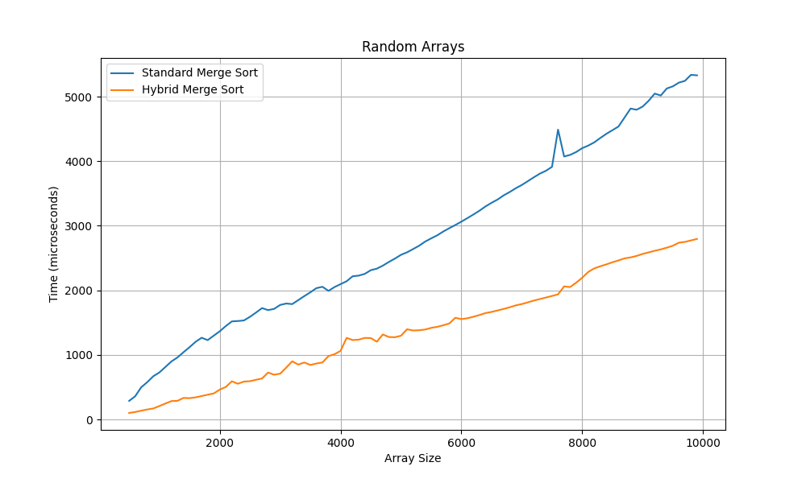

## На обратно отсортированных массивах
  
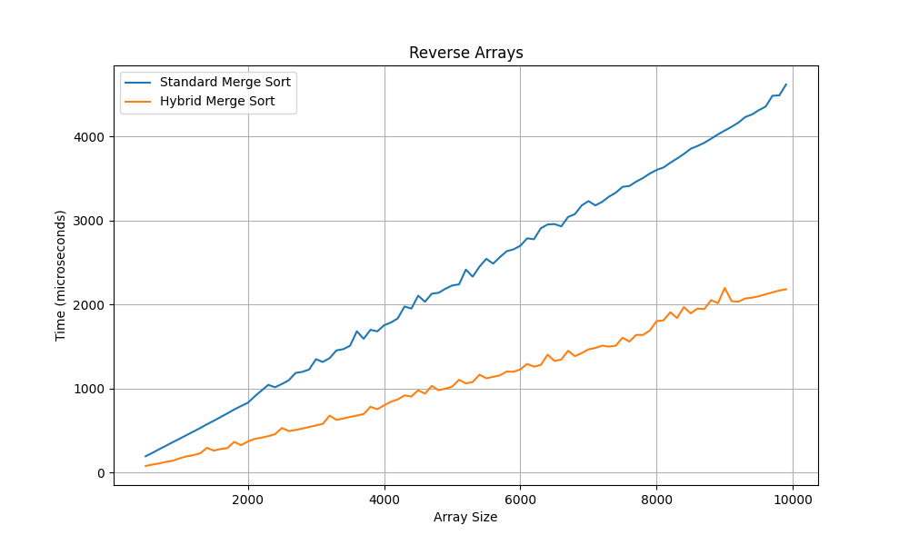
## На почти остортированных массивах

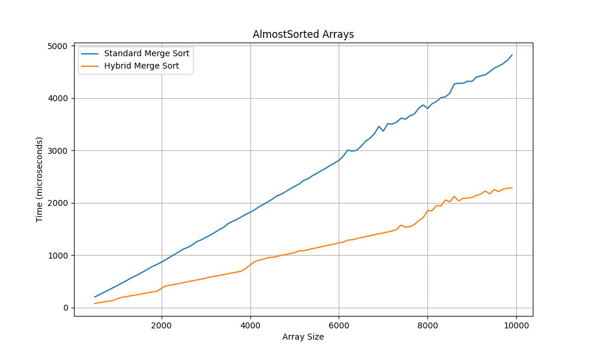

  

  
50

  
## На случайных массивах
  

## На обратно отсортированных массивах
  
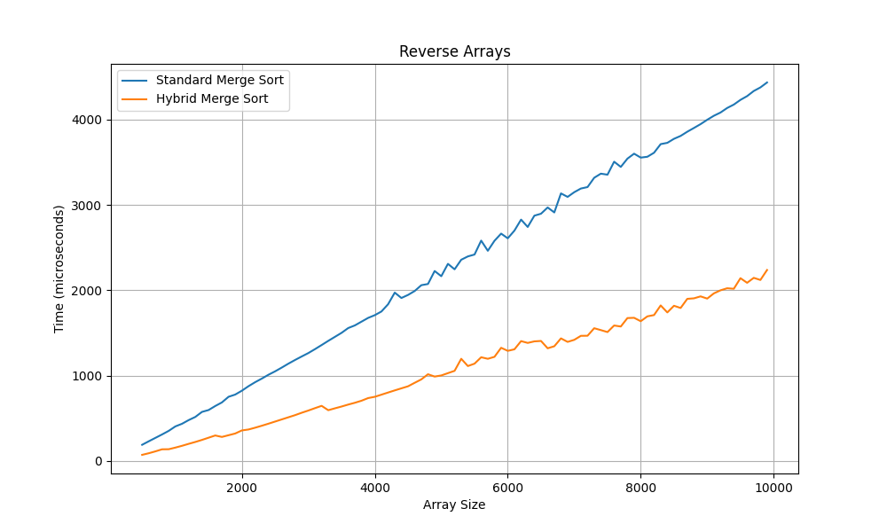
## На почти остортированных массивах

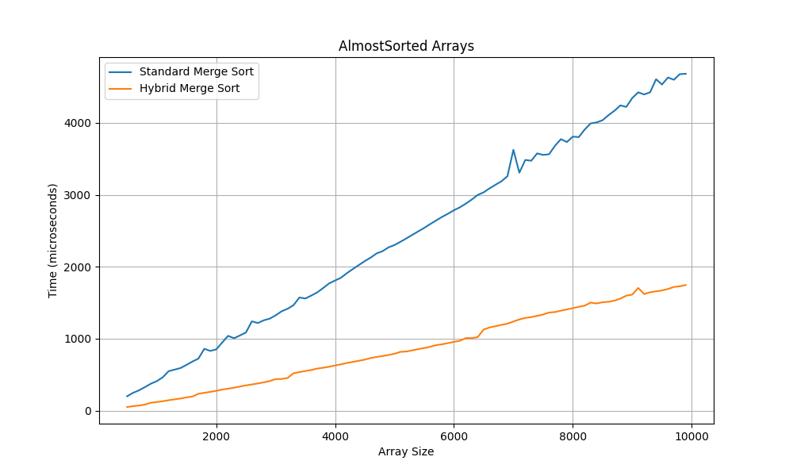

  

  
200

  
## На случайных массивах
  
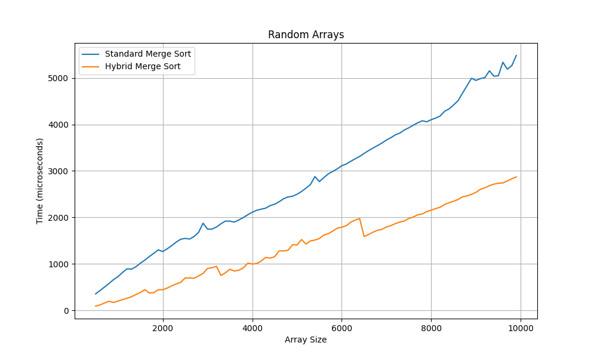

## На обратно отсортированных массивах
  
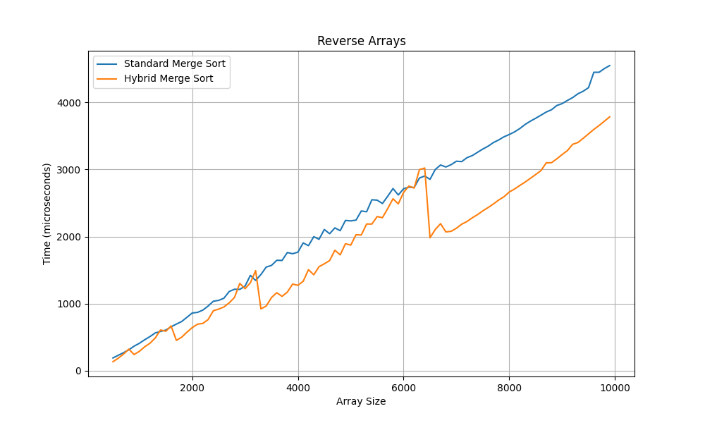
## На почти остортированных массивах
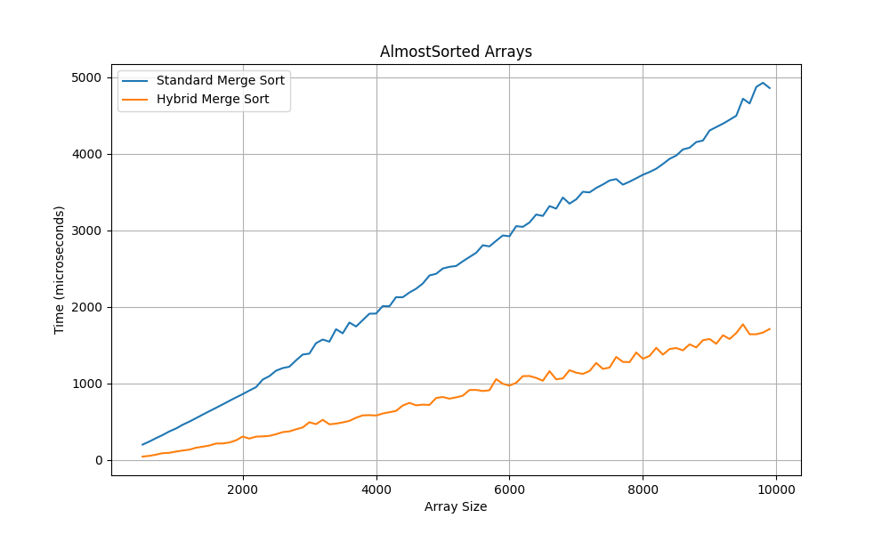

  

  
500

  
## На случайных массивах
  
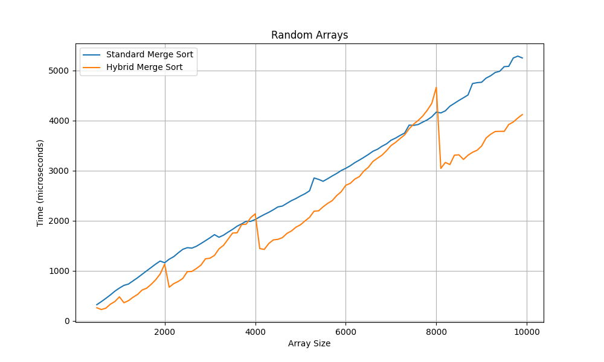

## На обратно отсортированных массивах
  
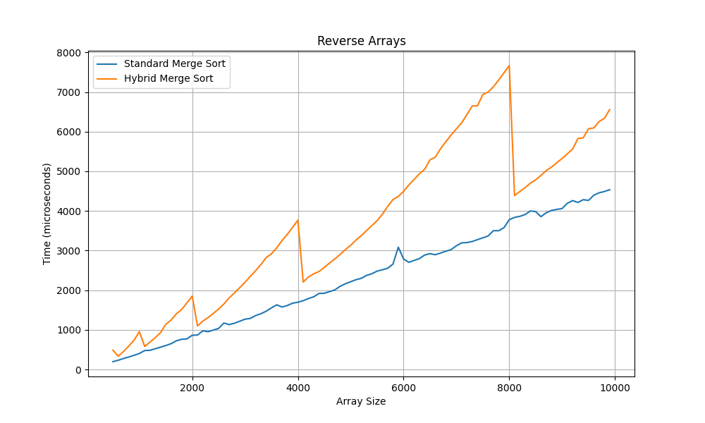
## На почти остортированных массивах

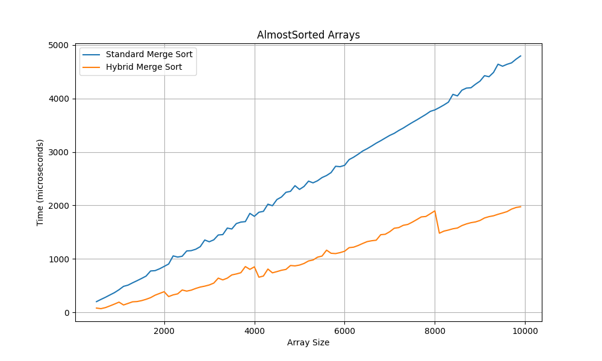

  
750

  
## На случайных массивах
  
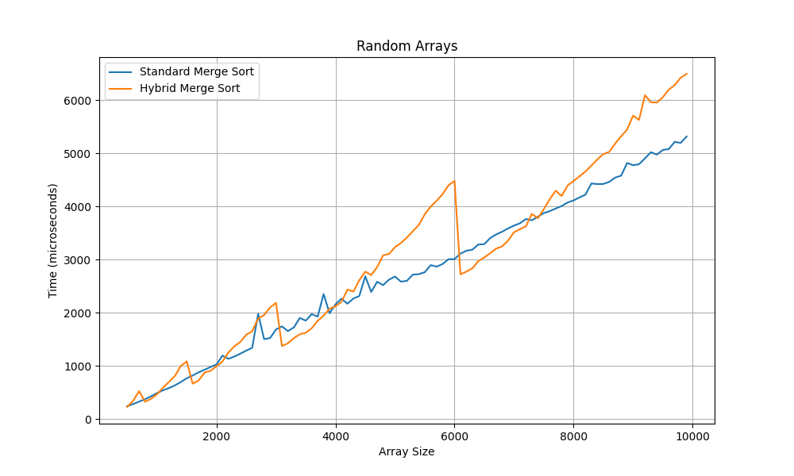

## На обратно отсортированных массивах
  
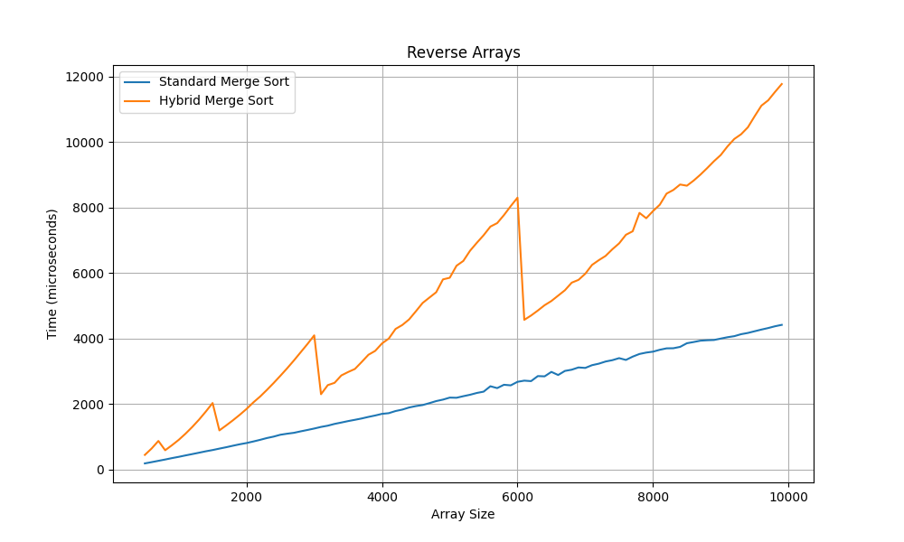
## На почти остортированных массивах

  
1000

  
## На случайных массивах
  
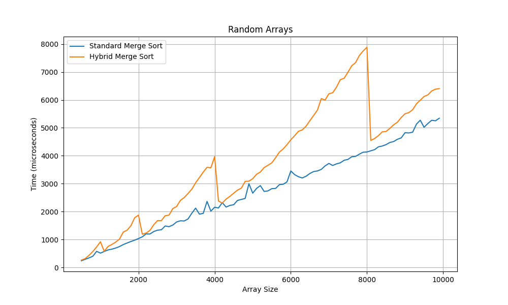

## На обратно отсортированных массивах
  
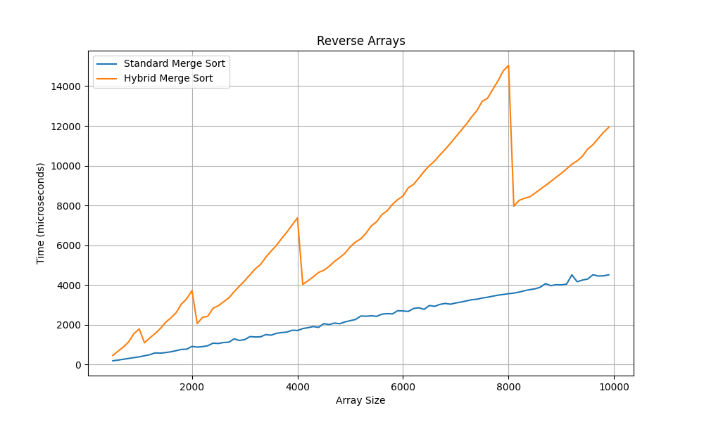
## На почти остортированных массивах

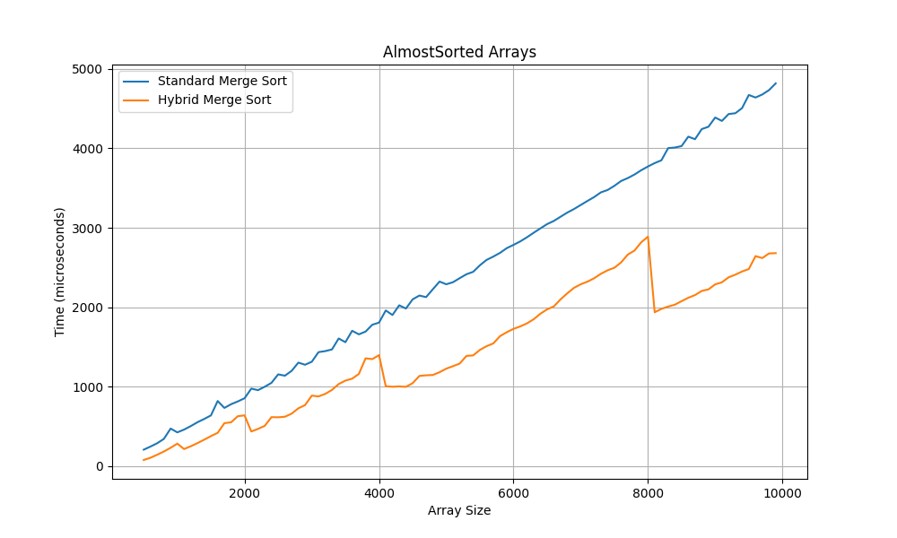

# Сравнительный Анализ
